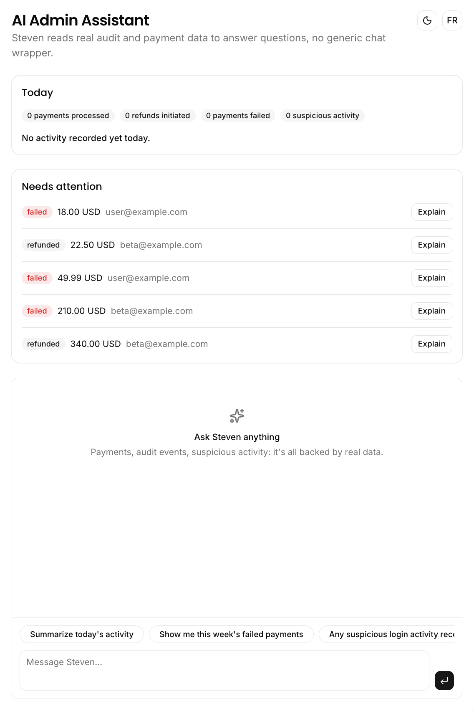
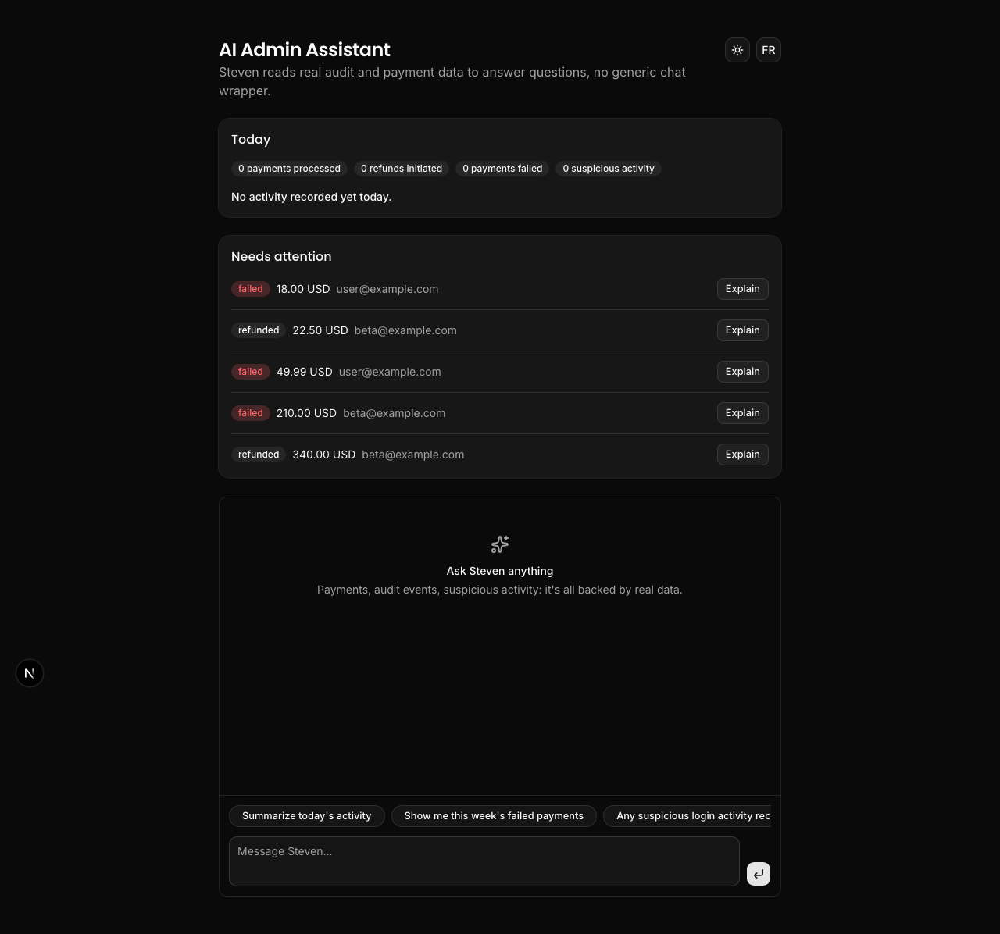

# AI Admin Assistant

## Why this exists

Most "AI admin assistant" projects are a thin wrapper around a chat API with no real context. This one is not. The assistant, Steven, is genuinely useful: it reads from the real business data of the other modules in this ecosystem (Audit Log, Payment Tracking), not from a generic prompt.

The core idea: ask a plain-language question about what happened in the system, and get an answer grounded in actual data, not a guess.

## Features

- Automatic daily summary of activity, computed deterministically (payments processed, refunds initiated, payments failed, suspicious activity detected) and turned into a short narrative by the model, which never invents the numbers itself
- "Needs attention" panel listing recent failed or refunded payments, with a one click plain-language explanation of what happened
- Steven, a chat assistant with real tools (`queryAuditLogs`, `queryPayments`) that reads Supabase before answering, for example "show me this week's failed payments" or "any suspicious login activity recently?"
- Light/dark theme, with interaction sounds via cuelume
- French/English UI, and Steven answers in whichever language is selected

## Tech stack

- Next.js (App Router)
- AI SDK + Vercel AI Gateway, routed to OpenAI GPT-5.4 mini
- ai-elements chat components (conversation, message, prompt input, tool calls)
- Supabase (reads `audit_logs` and `payments`, `payments` schema owned by this repo)
- Tailwind CSS + Shadcn UI
- next-themes (dark/light mode) + cuelume (interaction sounds)
- pnpm

## Screenshots / Demo GIF

Light mode:

Dark mode:

Explaining a failed payment and asking Steven a question:

## How to reuse

1. Clone the repo and install dependencies: `pnpm install`
2. Add your Supabase credentials and AI Gateway auth to `.env.local` (see `.env.example`); `VERCEL_OIDC_TOKEN` is enough locally if the project is linked with `vercel link` and pulled with `vercel env pull`, otherwise set `AI_GATEWAY_API_KEY`
3. Run `supabase/schema.sql` against your database to create the `payments` table (it references the shared `users` table from `feature-flags-dashboard/supabase/schema.sql`)
4. Optionally run `supabase/seed.sql` to populate a few days of demo payments, including a couple of realistic failure and refund reasons for Steven to explain
5. Run `pnpm dev`, then ask Steven something on the homepage, or click "Explain" on a payment in the "Needs attention" panel

## Architecture

- `lib/data/` is the only place that talks to Supabase: `audit-logs.ts` and `payments.ts` expose typed, filtered reads plus a couple of small aggregates (`getDailyPaymentStats`, `countSuspiciousLoginBursts`, `getRecentProblemPayments`)
- `lib/ai/daily-summary.ts` computes the day's stats from `lib/data/` first, then hands the already-correct numbers to `generateObject` so the model only writes the narrative, it never guesses a count
- `lib/ai/explain-payment.ts` turns a single payment's recorded `failure_reason`/`refund_reason` into a plain sentence with `generateText`, in the selected locale
- `lib/ai/tools.ts` wraps the same `lib/data/` reads as AI SDK tools (`queryAuditLogs`, `queryPayments`); `app/api/chat/route.ts` streams Steven's replies with those tools registered and a locale-aware system prompt
- `components/steven/chat.tsx` renders the conversation with `ai-elements` components, including a collapsible view of each tool call's input/output
- `components/steven/payment-explainer.tsx` is the "Needs attention" panel, a client component that calls the `explainPaymentAction` server action (`app/actions.ts`) and shows the result inline
- `lib/i18n/` holds `en.json`/`fr.json` dictionaries; `app/page.tsx` reads the `lang` search param, picks a dictionary, and passes both `dict` and `locale` down so static copy and Steven's own replies stay in the same language
- `components/theme-provider.tsx` and `cuelume-provider.tsx` wrap the app once in `app/layout.tsx`; interactive elements opt into a sound with `data-cuelume-*` attributes
